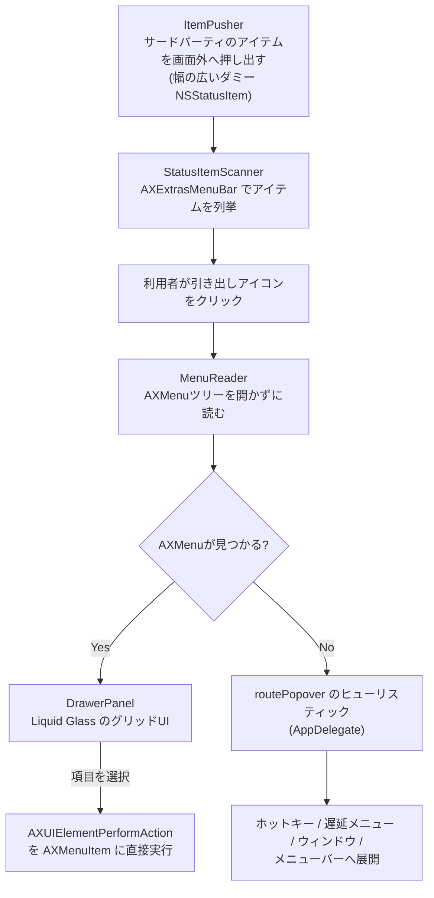

# menubar-drawer

過密になった macOS のメニューバーを片付ける常駐アプリ。サードパーティのステータスアイテムを画面外へ押し出し、ガラスの引き出しからカーソルを一切合成せずに操作できる。

[English](README.md) | [日本語](README.ja.md) | [中文](README.zh.md)


## Why

macOS は全てのアプリにメニューバーへアイコンを置く権利を与えているが、それらを隠す・グループ化する・管理するための標準機能は無い。Bartender・Ice・Hidden Bar のような定番の解決策は、あふれたアイテムを画面外へ押し出して隠すが、実際にそのアイテムを使うには結局メニューバーへ呼び戻して探してクリックする必要がある。menubar-drawer は違うアプローチを取る。macOS の Accessibility（AX）ツリーは、画面外に隠れて一度も開かれていないステータスアイテムのメニューでもそのまま公開している。この事実を利用して、アプリはそのメニューを直接読み取り、1つの引き出しから操作できるようにした。アイテムをメニューバーへ戻す必要も、カーソルをそこまで動かす必要も無い。

## Features

- **見えるアイコンは1つだけ。** サードパーティのステータスアイテムは、Hidden Bar / Ice / Bartender と同じ「幅の広いダミー `NSStatusItem`」の手法で画面外へ押し出す。残るのは引き出しのアイコンと、OS 純正の項目（時計・バッテリー・Wi-Fi・コントロールセンター）だけ。
- **アイコンを押すと、真下にガラスの引き出しが降りてきて**、隠れているアイテムがアイコンのグリッドで並ぶ。
- **メニューを開かずに中身を読む。** これがこのプロジェクトの技術的な核心で、[`MenuReader.swift`](Sources/MenuBarDrawer/MenuReader.swift) に実装されている。macOS の Accessibility ツリーは、ステータスアイテムが画面外にあり一度もメニューを開いていない状態でも `AXMenu` とその子である `AXMenuItem` を公開している。`MenuReader` はこのツリーを（サブメニュー3階層まで）辿って引き出し自前の `NSMenu` を組み立て、選ばれた項目は `AXUIElementPerformAction(..., kAXPressAction)` を該当の `AXMenuItem` へ直接送ることで実行する。対象アプリ自身のメニューは一度も開かれず、カーソルもそこへ移動する必要が無い。
- **`AXMenu` を持たないアプリへのヒューリスティック・フォールバック。** `NSMenu` ではなく `NSPopover` で作られたアプリは AX メニューツリーを一切公開しないため、アプリはアイテムを押した上で「押した直後に何が起きたか」を5パターンに振り分ける——Spotlight 風のグローバルホットキー、遅延生成されるメニュー、画面内に出るウィンドウ、位置調整が必要な画面外ウィンドウ、そして「諦めてメニューバーへ展開する」。各ルート（`AppDelegate.swift` の `routePopover`）は、作者自身のメニューバー上の実アプリで実測しながら決めたもの。
- **Liquid Glass の引き出しUI。** `NSVisualEffectView` の `.hudWindow` マテリアルと `.behindWindow` ブレンディングで構築しており、背後に映っているものをライブでぼかす（SwiftUI 自体の `Material` / `glassEffect` はウィンドウの背後をサンプリングできないため、ガラス層は素の AppKit で作り、その上に SwiftUI のコンテンツを載せている）。
- **引き出しアイコンを右クリック**すると、押し出しの一時解除・アクセシビリティ設定を開く・終了、のコンテキストメニューが出る。
- **メニューバーの並べ替えは100%ネイティブのまま。** ⌘ドラッグという macOS 標準の操作で行い、アプリ自身がアイテムの並び順に手を加えることは無い。

## Architecture



## Tech Stack

Swift 6、AppKit（ステータスアイテム・パネル・Accessibility API）、SwiftUI（引き出しの中身のみ）、macOS の Accessibility API（`ApplicationServices` / `AXUIElement`）、Swift Package Manager。サードパーティ依存は無し。

## Getting Started

必要環境: macOS 14+、Swift 6 ツールチェーン（Xcode または Swift ツールチェーンインストーラ）、Apple Development の署名証明書（ad-hoc 署名を使わない理由は [Design Decisions](#design-decisions) を参照）。

```bash
git clone <このリポジトリ>
cd menubar-drawer
./scripts/build_app.sh       # swift build -c release の後、dist/menubar-drawer.app をパッケージ化してコード署名
open dist/menubar-drawer.app
```

初回起動時、アクセシビリティ権限の許可を求められたら許可する（システム設定 → プライバシーとセキュリティ → アクセシビリティ）。許可しないと引き出しは空のままで、アプリ内に設定への導線が表示される。

- **右クリック**: 押し出しの一時解除 / 設定 / 終了。
- **並べ替え**: 通常の macOS の操作どおり ⌘ドラッグ。引き出しアイコンより左に置けば折りたたまれ、右に置けば常に見える。

## Project Structure

```
Sources/MenuBarDrawer/
  main.swift               起動処理
  AppDelegate.swift        アイコン・引き出しのライフサイクル、ポップオーバー振り分けのヒューリスティック、右クリックメニュー
  MenuReader.swift          ★中核: AXメニュー項目を開かずに読み、AXPressで実行する
  StatusItemScanner.swift  AXツリー経由でステータスアイテムを列挙
  ItemPusher.swift         画面外への押し出し帯（幅可変のダミー NSStatusItem）
  DrawerPanel.swift        Liquid Glass の引き出し（NSPanel + SwiftUI）
  SpotlightHotkey.swift    利用者が設定した実際の Spotlight ショートカットを読み取り合成する
  WindowDetector.swift     フォールバック振り分けのためのポップオーバー/ウィンドウ出現検知
spike/                     単体の技術検証スクリプト（`swift spike/xxx.swift` で実行）
  read_menu.swift           ★アーキテクチャ全体を決めた検証: メニューを一度も開かずに、
                             隠れたアイテムのメニュー項目を読み取り実行できるか
```

## Design Decisions

**他アプリのステータスアイテムを操作するために、マウスカーソルを動かす・合成クリックすることは一切しない。** これは制約ではなく、検証した上で意図的に不採用にした判断である。⌘ドラッグの合成によるアイテム並べ替えは単体では動作することを確認済み（テスト用アイテムを x=1178 から x=957 へ実際に移動できた）が、**採用しなかった**。理由は、それが利用者本来のカーソルを勝手に奪う操作になるため。どうしても他の方法で届かないアイテムがある場合は、画面上にその旨と代替手段（自分で⌘ドラッグする）を示すだけで、黙ってマウスの制御を奪うことはしない。唯一の狭い例外は、右クリックメニューの設定（**既定 OFF**）で、利用者が今まさに自分でメニューバーへ展開したアイテムに対してのみ、1回だけ合成クリックを行うものだけ。

**メニューを開かずに AX で読めるという発見が、この設計全体を可能にした。** これが確認される前（`spike/read_menu.swift` 参照）は、隠れたステータスアイテムを操作する唯一の方法は、それをメニューバーへ戻して実際にクリックすることだった。画面外にあり一度も開かれていないアイテムでも `AXMenu` / `AXMenuItem` の完全なツリーが公開されていると確認できたことで、「メニューを読み取り、自前のUIで見せ、選ばれた項目を直接実行する」という自己完結型の引き出し設計が、大半のケースでカーソルを一切動かさずに成立するようになった。

**ad-hoc / 自己署名ではなく、正規の Apple Development 署名証明書を使う。** ad-hoc 署名はビルドのたびにバイナリの `cdhash` が変わり、このアプリが機能するために不可欠なアクセシビリティ権限の許可がリセットされてしまう。安定した Development 証明書で署名することで、開発中の再ビルドをまたいで権限を保持できる。

## Status

作者自身の実際のメニューバー環境に対して動かし続けている個人用ツール（実測結果とアプリごとの振り分け結果はソースコードのコメントに焼き込まれている）。個人利用向けにローカルの Apple Development 証明書で署名しており、公証や App Store 配布は行っていないため、ビルド・署名したマシン上でのみ動作する。自動テストスイートは無く、`spike/` の検証スクリプトと実アプリに対する手動テストで正しさを確認している。ポップオーバー振り分けのどのヒューリスティックにも該当しないアプリは、従来どおりメニューバーへの展開にフォールバックする。

## License

[MIT](LICENSE)
