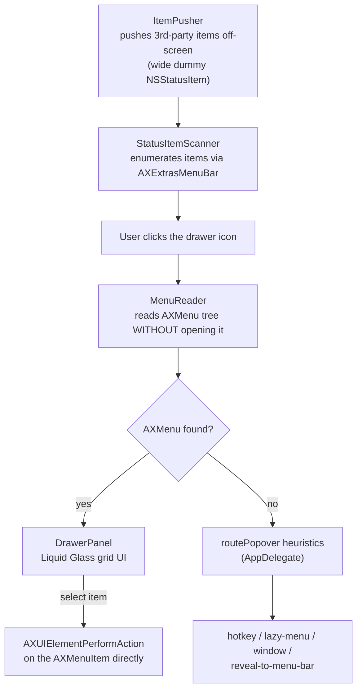

# menubar-drawer

Declutter an overcrowded macOS menu bar — push third-party status items out of sight and control them from a glass drawer, without a single synthetic mouse movement.

[English](README.md) | [日本語](README.ja.md) | [中文](README.zh.md)


## Why

macOS gives every app the right to plant an icon in the menu bar, and gives you no built-in way to hide, group, or manage them. The usual fix — Bartender, Ice, Hidden Bar — hides the overflow by pushing it off-screen, but to actually *use* one of those hidden items you still have to reveal it back onto the visible bar, find it, and click it. menubar-drawer takes a different approach: since macOS's Accessibility (AX) tree exposes a hidden item's menu even while it's sitting off-screen and unopened, the app can read that menu directly and let you act on it from a single drawer — the item never has to come back onto the bar, and the mouse cursor never has to move to reach it.

## Features

- **One visible icon.** Every third-party status item is pushed off-screen using the same wide-dummy-`NSStatusItem` technique as Hidden Bar/Ice/Bartender; only the drawer icon and Apple's own menu-bar items (clock, battery, Wi-Fi, Control Center) remain.
- **Click the icon → a glass drawer drops down** directly below it, showing every hidden item as an icon in a grid.
- **Reads each item's menu without opening it.** This is the technical core of the project, implemented in [`MenuReader.swift`](Sources/MenuBarDrawer/MenuReader.swift): macOS's Accessibility tree exposes an `AXMenu` and its `AXMenuItem` children for a status item even when that item is off-screen and its menu has never been opened. `MenuReader` walks that tree (up to 3 levels of submenus) to build the drawer's own `NSMenu`, and executes the chosen item by sending `AXUIElementPerformAction(..., kAXPressAction)` straight to the underlying `AXMenuItem` — the target app's own menu never has to open, and the cursor never has to travel to it.
- **Heuristic fallback for apps without an `AXMenu`.** Apps built on `NSPopover` (not `NSMenu`) don't expose an AX menu tree at all, so the app presses the item and classifies *what happened next* into one of five routes — a Spotlight-style global hotkey, a lazily-generated menu, an on-screen window, an off-screen window that needs repositioning, or "give up and reveal it to the menu bar." Each route (`routePopover` in `AppDelegate.swift`) was derived empirically against real apps on the author's own menu bar.
- **Liquid Glass drawer UI** built on `NSVisualEffectView` with `.hudWindow` material and `.behindWindow` blending, so the drawer live-blurs whatever's on screen behind it (SwiftUI's own `Material`/`glassEffect` can't sample behind the window, so the glass layer is plain AppKit wrapped for SwiftUI content).
- **Right-click the drawer icon** for a context menu: temporarily un-collapse the pushed items, jump to Accessibility settings, or quit.
- **Menu bar reordering stays 100% native** — drag items with Cmd as macOS normally allows; the app never touches item order itself.

## Architecture



## Tech Stack

Swift 6, AppKit (status items, panels, Accessibility API), SwiftUI (drawer content view only), the macOS Accessibility APIs (`ApplicationServices` / `AXUIElement`), and Swift Package Manager. No third-party dependencies.

## Getting Started

Requirements: macOS 14+, a Swift 6 toolchain (Xcode or the Swift toolchain installer), and an Apple Development signing certificate (see [Design Decisions](#design-decisions) for why ad-hoc signing isn't used).

```bash
git clone <this repo>
cd menubar-drawer
./scripts/build_app.sh       # swift build -c release, then packages + code-signs dist/menubar-drawer.app
open dist/menubar-drawer.app
```

On first launch, grant Accessibility permission when prompted (System Settings → Privacy & Security → Accessibility). Without it, the drawer stays empty and shows an in-app hint pointing you to the setting.

- **Right-click** the drawer icon for temporary un-collapse / settings / quit.
- **Reorder** the menu bar the normal macOS way: Cmd-drag. Anything left of the drawer icon gets collapsed; anything right of it always stays visible.

## Project Structure

```
Sources/MenuBarDrawer/
  main.swift               Entry point
  AppDelegate.swift        Icon + drawer lifecycle, popover-routing heuristics, context menu
  MenuReader.swift          ★ core: reads AX menu items without opening them, executes via AXPress
  StatusItemScanner.swift  Enumerates status items via the AX tree
  ItemPusher.swift         The push-off-screen band (variable-width dummy NSStatusItem)
  DrawerPanel.swift        The Liquid Glass drawer (NSPanel + SwiftUI)
  SpotlightHotkey.swift    Reads the user's real Spotlight shortcut and synthesizes it
  WindowDetector.swift     Detects popover/window appearance for the fallback routing
spike/                     Standalone technical spikes (run with `swift spike/xxx.swift`)
  read_menu.swift           ★ the experiment that decided the whole architecture:
                             can a hidden item's menu be read, and its items executed,
                             without ever opening the menu?
```

## Design Decisions

**The mouse cursor is never moved or synthetically clicked to operate another app's status item.** This is a deliberate, tested-and-rejected trade-off, not a limitation: synthesizing a Cmd-drag to reorder items was proven to work in isolation (moved a test item from x=1178 to x=957), but it was **not adopted**, because doing so takes over the user's actual cursor. Where an item genuinely can't be reached any other way, the app says so on screen and offers the manual alternative (Cmd-drag it yourself) instead of silently taking control of the mouse. The one narrow, opt-in exception is a right-click setting, **default OFF**, that performs a single synthetic click only on an item the user just explicitly revealed to the menu bar themselves.

**Reading AX menus without opening them is what made the whole design possible.** Before this was confirmed (see `spike/read_menu.swift`), the only way to operate a hidden status item was to reveal it and click it for real. Once it was confirmed that off-screen, unopened items still expose a full `AXMenu`/`AXMenuItem` tree, the "self-contained drawer" design — read the menu, show it in the app's own UI, execute the chosen entry directly — became possible without moving the cursor at all for the common case.

**A real Apple Development signing identity is used instead of ad-hoc/self-signing.** Ad-hoc signing changes the binary's `cdhash` on every rebuild, which resets the Accessibility permission grant — the one permission this app cannot function without. Signing with a stable Development identity keeps that grant intact across rebuilds during iteration.

## Status

A working personal tool, exercised against a specific real-world menu bar (see the empirical findings and per-app routing table baked into the source comments). It is signed with a local Apple Development certificate for personal use — not notarized or distributed via the App Store, so it only runs on the machine(s) it's built and signed on. There's no automated test suite; correctness is validated with the `spike/` scripts and manual testing against real apps. Some apps still fall back to the plain "reveal to menu bar" behavior when none of the popover-routing heuristics match.

## License

[MIT](LICENSE)
