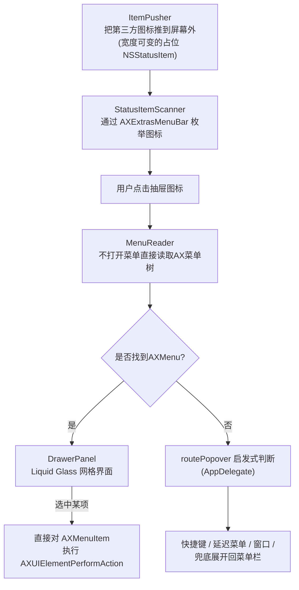

# menubar-drawer

为拥挤不堪的 macOS 菜单栏瘦身——把第三方状态图标推出可见区域,再从一个玻璃质感的"抽屉"里操作它们,全程不合成任何鼠标移动。

[English](README.md) | [日本語](README.ja.md) | [中文](README.zh.md)


## Why(为什么做这个)

macOS 允许任何应用在菜单栏放一个图标,却没有提供隐藏、分组或管理它们的内置方式。Bartender、Ice、Hidden Bar 这类常见方案,是把溢出的图标推到屏幕外来"隐藏"它们,但如果你真的要*使用*其中某一个,还是得先把它拉回可见的菜单栏、找到它、再点击。menubar-drawer 换了一种思路:macOS 的 Accessibility(AX)树,即便某个状态图标正处于屏幕外、菜单从未被打开过,依然会把它的菜单结构暴露出来。利用这一点,应用可以直接读取那份菜单,让你在一个抽屉里完成操作——图标完全不需要被拉回菜单栏,鼠标光标也完全不需要移动过去。

## Features(功能)

- **只留一个可见图标。** 所有第三方状态图标都会用 Hidden Bar/Ice/Bartender 同款手法——一个宽度很大的占位 `NSStatusItem`——推到屏幕外;留在菜单栏上的只有抽屉图标本身,以及系统自带项目(时钟、电池、Wi-Fi、控制中心)。
- **点击图标,玻璃抽屉从正下方滑出**,以图标网格的形式展示所有被隐藏的项目。
- **不打开菜单就能读取其内容。** 这是本项目的技术核心,实现在 [`MenuReader.swift`](Sources/MenuBarDrawer/MenuReader.swift) 中:即使某个状态图标位于屏幕外、其菜单从未被打开过,macOS 的 Accessibility 树依然会暴露出该图标的 `AXMenu` 及其子元素 `AXMenuItem`。`MenuReader` 会遍历这棵树(最多 3 层子菜单),用读到的内容构建抽屉自己的 `NSMenu`;选中某一项后,直接对底层的 `AXMenuItem` 发送 `AXUIElementPerformAction(..., kAXPressAction)` 来执行——目标应用自身的菜单完全不需要打开,鼠标光标也不需要移动过去。
- **面向没有 `AXMenu` 的应用的启发式兜底方案。** 基于 `NSPopover`(而非 `NSMenu`)构建的应用根本不会暴露 AX 菜单树,因此应用会先按下该图标,再根据"按下之后发生了什么"归类到五条路径之一——类似 Spotlight 的全局快捷键、延迟生成的菜单、出现在屏幕内的窗口、需要重新定位的屏幕外窗口,或是"放弃兜底、直接展开回菜单栏"。每条路径(`AppDelegate.swift` 中的 `routePopover`)都是作者在自己实际使用的菜单栏环境中,针对真实应用逐一实测总结出来的。
- **Liquid Glass 抽屉界面。** 基于 `NSVisualEffectView`,使用 `.hudWindow` 材质和 `.behindWindow` 混合模式构建,能够实时模糊显示窗口背后的内容(SwiftUI 自带的 `Material`/`glassEffect` 无法采样窗口背后的画面,因此玻璃层用纯 AppKit 实现,再在其上承载 SwiftUI 内容)。
- **右键点击抽屉图标**弹出上下文菜单:临时取消折叠、跳转到辅助功能设置、退出应用。
- **菜单栏图标顺序调整完全保持原生。** 使用 macOS 标准的 Cmd 拖拽操作即可;应用本身从不修改图标的排列顺序。

## Architecture(架构)



## Tech Stack(技术栈)

Swift 6、AppKit(状态图标、面板、Accessibility API)、SwiftUI(仅用于抽屉的内容视图)、macOS 的 Accessibility API(`ApplicationServices` / `AXUIElement`)、Swift Package Manager。没有任何第三方依赖。

## Getting Started(快速开始)

环境要求:macOS 14+、Swift 6 工具链(Xcode 或 Swift 工具链安装器)、一个 Apple Development 签名证书(不使用 ad-hoc 签名的原因见下方 [Design Decisions](#design-decisions))。

```bash
git clone <本仓库地址>
cd menubar-drawer
./scripts/build_app.sh       # 执行 swift build -c release,再打包并签名生成 dist/menubar-drawer.app
open dist/menubar-drawer.app
```

首次启动时,按提示授予辅助功能权限(系统设置 → 隐私与安全性 → 辅助功能)。未授权时抽屉会保持为空,并在应用内提示如何前往设置。

- **右键点击**抽屉图标:临时取消折叠 / 打开设置 / 退出。
- **调整顺序**:使用普通的 macOS 操作即 Cmd 拖拽。放在抽屉图标左侧会被折叠隐藏,放在右侧则始终可见。

## Project Structure(项目结构)

```
Sources/MenuBarDrawer/
  main.swift               程序入口
  AppDelegate.swift        图标与抽屉的生命周期、弹出层路由的启发式判断、右键菜单
  MenuReader.swift          ★核心:不打开菜单读取AX菜单项,通过 AXPress 执行
  StatusItemScanner.swift  通过 AX 树枚举状态图标
  ItemPusher.swift         推出屏幕外的占位条(宽度可变的占位 NSStatusItem)
  DrawerPanel.swift        Liquid Glass 抽屉界面(NSPanel + SwiftUI)
  SpotlightHotkey.swift    读取用户实际设置的 Spotlight 快捷键并合成按键
  WindowDetector.swift     为兜底路由检测弹出层/窗口的出现
spike/                     独立的技术验证脚本(用 `swift spike/xxx.swift` 单独运行)
  read_menu.swift           ★决定整体架构的关键验证:不打开菜单,
                             是否也能读取并执行隐藏图标的菜单项
```

## Design Decisions(设计决策)

**不会为了操作其他应用的状态图标而移动或合成点击鼠标光标。** 这是经过验证后主动放弃的方案,而不是能力上的限制:合成 Cmd 拖拽来调整图标顺序,单独测试时确实可行(曾把一个测试图标从 x=1178 移动到 x=957),但**最终没有采用**,因为这样做等于夺走了用户本来的鼠标光标控制权。当某个图标确实无法用其他方式触达时,应用会在界面上说明原因并给出替代方案(用户自己动手 Cmd 拖拽),而不是悄悄接管鼠标。唯一的、范围很窄的例外,是右键菜单里的一个设置项(**默认关闭**):仅当用户刚刚亲自把某个图标展开回菜单栏时,才会对它执行一次合成点击。

**"不打开菜单也能通过 AX 读取内容"这一发现,是整个设计得以成立的前提。** 在确认这一点之前(参见 `spike/read_menu.swift`),操作隐藏状态图标的唯一方式就是把它拉回菜单栏、真实点击它。一旦确认屏幕外、从未被打开过的图标依然会暴露完整的 `AXMenu`/`AXMenuItem` 树,"自包含抽屉"的设计——读取菜单、在自己的界面中展示、直接执行选中项——就在绝大多数情况下无需移动光标即可成立。

**使用正式的 Apple Development 签名证书,而非 ad-hoc / 自签名。** ad-hoc 签名会导致每次重新构建时二进制文件的 `cdhash` 发生变化,从而重置这个应用赖以运行的辅助功能权限授权。使用稳定的 Development 证书签名,可以让权限在开发迭代过程中的多次重新构建之间保持有效。

## Status(项目状态)

一个持续在作者本人真实菜单栏环境中使用验证的个人工具(实测结论和针对各个应用的路由判断结果都记录在源码注释中)。目前使用本地的 Apple Development 证书签名,面向个人使用,未经过公证也未通过 App Store 分发,因此只能在构建、签名它的那台机器上运行。没有自动化测试套件,正确性通过 `spike/` 目录下的验证脚本以及针对真实应用的手动测试来确认。对于不符合任何弹出层路由启发式规则的应用,仍会回退到原始的"展开回菜单栏"行为。

## License(许可证)

[MIT](LICENSE)
